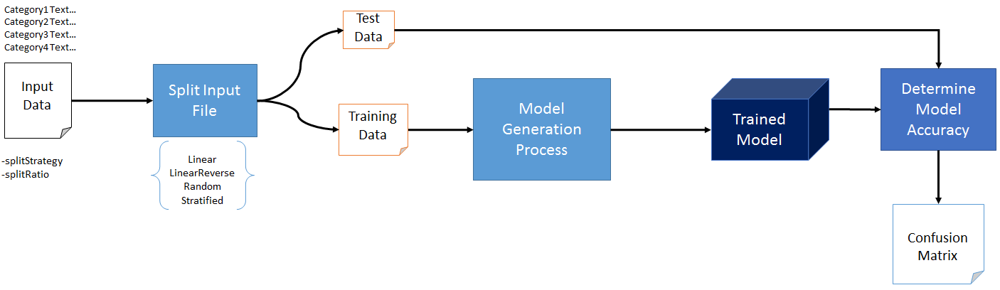

[](https://travis-ci.org/behzadaltaf/FileSplitter)

# FileSplitter
In a typical [Machine Learning](https://en.wikipedia.org/wiki/Machine_learning) model generation and evaluation process, the first step is to split the input file into Training and Test.



This API takes an input file in the following format ([OPEN-NLP](https://opennlp.apache.org/) format)

```    
    Category1 TextA
    Category2 TextB
    Category1 TextC
    Category2 TextZ 
```

The usage is as follows.

```Java
    Map<String, File> splitHandles = FileSplitter.splitFile(inputFile, splitStrategy, splitRatio)
    inputFile is of File type
    splitStrategy is String
    splitRatio is double
```


The various valid split strategies are provided below 
                                
**Linear**: This splitter splits the input file linearly into TEST and TRAINING. The bottom half of the file is used for test. e.g.if the split requested is 0.7 then top 70% is training and last 30% is test.

**LinearReverse**: This splitter splits the input file linearly into TEST and TRAINING. The top half of the file is used for test. e.g.if the split requested is 0.7 then top 30% is test and last 70% is training.
                                   
**Random**: This splitter splits the input file randomly into TEST and TRAINING. The splits are purely random with optimistic probability that java Random's probability. e.g.if the split requested is 0.7 then top random 70% are training and random 30% are test.
                                   
[**Stratified**](https://en.wikipedia.org/wiki/Stratified_sampling): This splitter splits the input file with stratification into TEST and TRAINING. The split is in the ratio of the categories. e.g.if the split requested is 0.7 then the splitter would put 70% of each category in training and rest 30% in test. The splitter would try to make this balance.   

The **split ratio** should be between 0.0 to 1.0

The output would be a map that has the **TRAINING** and **TEST** handles.  
